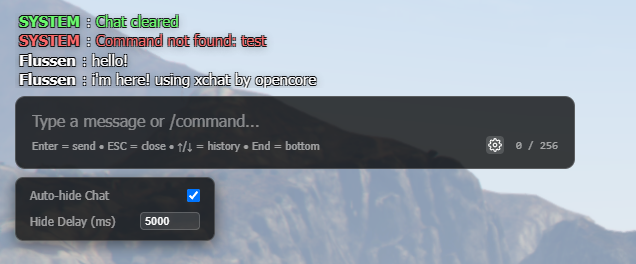

# xChat - SAMP Style Chat for OpenCore

A modern, high-performance chat system with a classic SA:MP-inspired aesthetic, built specifically for the **OpenCore Framework**.

## Features

- **Classic Aesthetic**: Minimalist design with text shadows for high visibility on any background.
- **Dynamic Character Counter**: Visual feedback (Orange/Red) as you approach the character limit.
- **Command History**: Use `Arrow Up` and `Arrow Down` to navigate through your previous messages.
- **Intelligent Scrolling**: Auto-scrolls to bottom, with a "New Messages" indicator if you've scrolled up.
- **Inline Color Codes**: Supports SAMP-style color codes (e.g., `{FF0000}Red Text`) for trusted server messages.
- **Auto-Hide System**: Configurable auto-hide with custom delays to keep the screen clean.
- **Roleplay Commands**: Built-in support for `/me`, `/do`, `/ooc`, `/shout`, `/whisper`, and more.
- **Distance Fade (Proximity Chat)**: Local messages fade to grayscale in **4 tonalities** based on distance to the sender.
- **Dev Mode**: Included browser-based testing environment for UI development without launching the game.

## Screenshots



## Installation

If you are using the OpenCore CLI:

```bash
opencore clone xchat
```

Then, ensure the resource in your `server.cfg`:

```cfg
ensure xchat
```

## Commands

### Player Commands
| Command | Description | Format |
|---------|-------------|--------|
| `/say` | Normal chat message | `/say [message]` |
| `/me` | Third-person action | `/me [action]` |
| `/do` | Environmental description | `/do [description]` |
| `/ooc` | Global Out-of-Character chat | `/ooc [message]` |
| `/b` | Local Out-of-Character chat | `/b [message]` |
| `/pm` | Private message to a player | `/pm [id] [message]` |
| `/shout` | Shout message (visible from distance) | `/shout [message]` |
| `/whisper`| Quiet message | `/whisper [message]` |
| `/clear` | Clears your chat window | `/clear` |

### Staff Commands
| Command | Description | Format |
|---------|-------------|--------|
| `/announce`| Server-wide announcement | `/announce [message]` |

## Developer API

### Exports
You can send messages from other resources using the `xchat` export:

```typescript
// Server-side
exports.xchat.sendChatMessage("Hello World", "SYSTEM", 255, 255, 255);
```

### Configuration
Customize the chat behavior in `ui/src/config.ts`:

- `MAX_INPUT_LENGTH`: Set the character limit for the input.
- `ALLOW_PLAYER_SETTINGS`: Toggle whether players can see and change auto-hide settings.
- `AUTO_HIDE_DURATION`: Set the default time before the chat fades out.

---
Built with ❤️ for the OpenCore Team.
